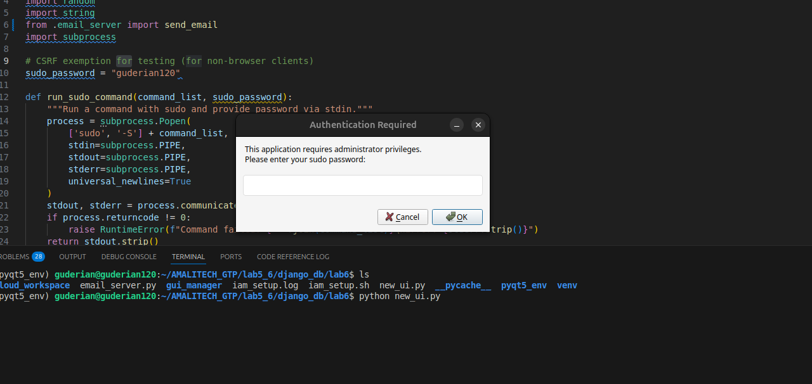
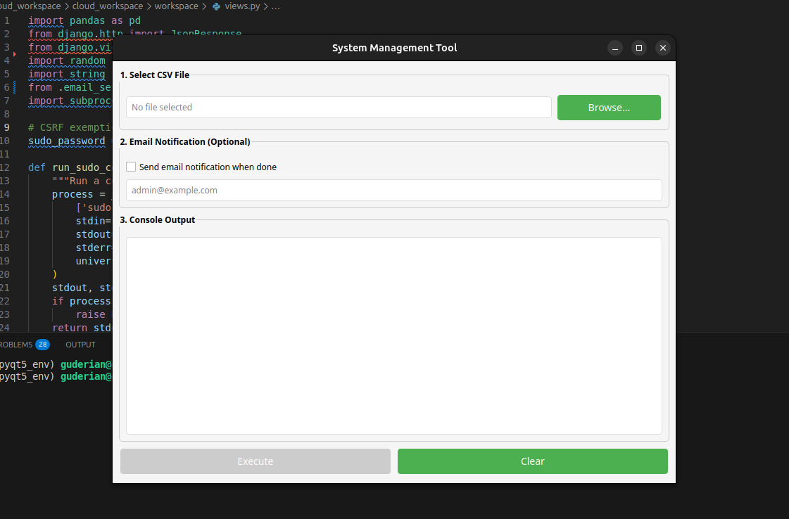

# PyQt5 GUI for Linux (Ubuntu Preferred)

This project provides a graphical user interface (GUI) built with **PyQt5**, designed to run on **Linux-based systems** (preferably Ubuntu). It includes functionality for file selection, user interaction, sudo authentication, and optional email notifications.

## 🚀 Features

* Linux sudo password prompt via GUI
* CSV file selection and validation
* Real-time console logging
* "Execute" button enabled on valid file selection
* Optional email notification to system administrators
* Clean and responsive PyQt5 interface

> ⚠️ This project is intended to run on **Linux systems only** (preferably Ubuntu) and assumes the executing environment has appropriate privileges (sudo access).

---

## 🛠️ Installation & Setup

Clone the repository:

```bash
git clone https://github.com/guderian120/PyQt5-SysMan
cd PyQt5-SysMan
```

Create and activate a virtual environment:

```bash
python3 -m venv venv
source venv/bin/activate
```

Install the required packages:

```bash
pip install -r requirements.txt
```

---

## ▶️ Running the Application

To start the application, run:

```bash
python gui_sys_management.py
```

### 🔐 Sudo Authentication

* Upon running, a GUI dialog will prompt for your **sudo password**.
* If you're already authenticated in the terminal session, the password input will be accepted regardless of correctness (due to cached authentication).
* If not authenticated, an incorrect password will result in an error.

 <!-- Replace # with actual image URL -->

---

## 🧑‍💻 Using the GUI

After successful authentication:

1. A clean and interactive UI will appear.
2. Click **Browse** to select your CSV file.
3. Ensure your CSV has the following headers:

   * `username`
   * `full_name`
   * `department`
   * `email`
4. Once a valid file is loaded:

   * The content will be logged in the console.
   * The **Execute** button becomes active.
5. Optionally check **"Send email notification when done"** to notify a sysadmin. You’ll be prompted to enter their email address.

 <!-- Replace # with actual image URL -->

---

## 🎥 Demo

Watch the app in action:

[](/media/gui_pyqt5.gif) <!-- Replace # with actual video link -->

---

## 📂 Source Code

The source code is available in this repository. Feel free to explore, understand, and customize it as needed.

---

## 📌 Notes

* This application is **Linux-only** and best tested on **Ubuntu**.
* Be sure to clean your CSV files and match the required headers.
* This is a local GUI app; no workspace is provisioned externally.

---
